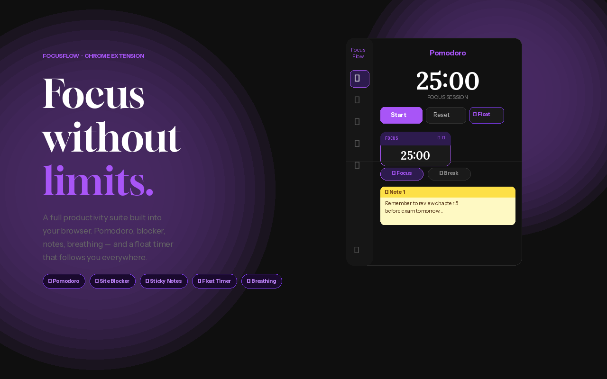
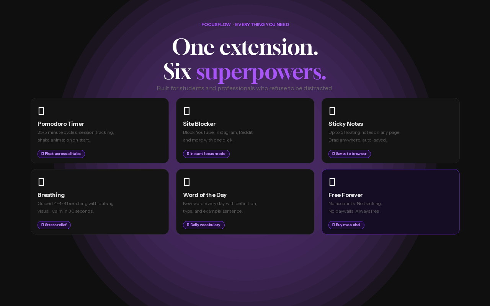
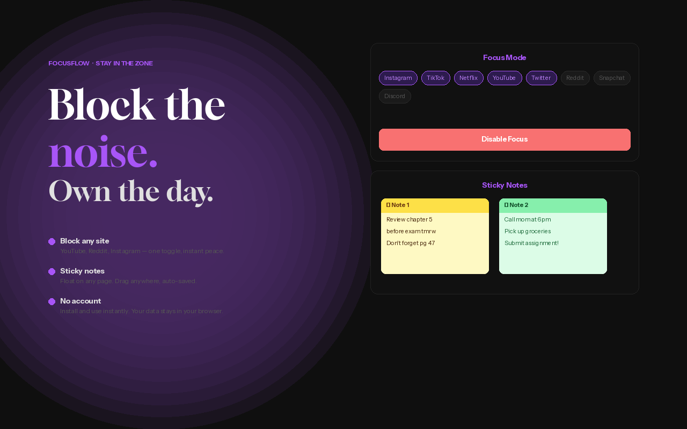

# FocusFlow

Stay focused with a Pomodoro timer, site blocker, sticky notes and more, right inside Chrome.

[Get it on the Chrome Web Store](https://chromewebstore.google.com/detail/focusflow/pdigglodeopcihimpdkcbkoemhbjbdno)

## Screenshots

## Features
- Pomodoro timer
- Focus Mode (blocks distracting sites)
- Sticky notes
- Floating timer
- Breathing exercise

## Install
- Easy way: install from the Chrome Web Store link above
- Manual way: download this repo, open chrome://extensions, turn on Developer mode, click Load unpacked, and select the folder

## Tech used
JavaScript, HTML, CSS, Chrome Extension APIs

## Author
Made by Rohit
